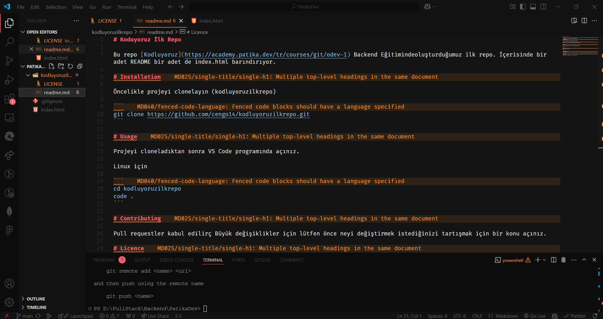

# Koduyoruz İlk Repo

Bu repo [Kodluyoruz](https://academy.patika.dev/tr/courses/git/odev-1) Backend Eğitiminde oluşturduğumuz ilk repo. İçerisinde bir adet README bir adet de index.html barındırıyor.

# Installation

Öncelikle projeyi clonelayın (kodluyoruzilkrepo)

```
git clone https://github.com/cengo14/kodluyoruzilkrepo.git
```

# Usage

Projeyi cloneladıktan sonra VS Code programında açınız.

Linux için

```
cd kodluyoruzilkrepo
code .
```

# SecreenShots



# Contributing

Pull requestler kabul edilir. Büyük değişiklikler için lütfen önce neyi değiştirmek istediğinizi tartışmak için bir konu açınız.

# Licence

[MIT](https://choosealicense.com/licenses/mit/)
